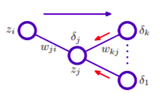

## Understand backpropagation
- Neural network is the most important basis of Deep learning. It's release has brought AI closer to us. It like human's brain.

## Forwarding 
- This is process calculate value for each node in the neural network. It's have us to inferred output of neural network. 

## Backpropagation
- It's a process of updating weights of neural network using optimize algorithms like Gradient Descent (SGD, RMS, ...)
- Here we will example backpropagation of a neural network like bellow, with:
    - Loss: MSE
    - activation at each node: sigmoid  

    

    - In order to update weight, Gradient Descent requires us to calc derivative of Loss by each weight, so can have:
    
    
    So in order to calc derivative of loss by weight, we only need to calculate  

    - Because derivative computation of loss of the output layer different from the hidden layer, so we have separately result:
        - With output layer:  
        

        - With hidden layer:
        
