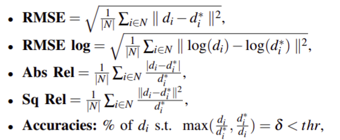
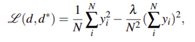

# Monocular depth estimation

## **Dataset**
### KITTI dataset
-  The real images from “city”, “residential” and “road” categories are collected in the KITTI dataset, and the 56 scenes in the KITTI dataset are divided into two parts, 28 ones for training and the other 28 ones for testing, by Eigen et al. [35]. Each scene consists of stereo image pairs with a resolution of 1224×368. The corresponding depth of every RGB image is sampled in a sparse way by a rotating LIDAR sensor

- LIDAR là một phương pháp khảo sát đo khoảng cách tới mục tiêu bằng cách chiếu sáng mục tiêu đó bằng một tia laze xung quanh và đo các xung phản xạ bằng một cảm biến. Sự khác biệt về thời gian và bước sóng laser sau đó có thể được sử dụng để tạo mô hình số 3 chiều (3D) của đối tượng

### NYU Depth dataset
- There are 464 indoor scenes in this dataset with resolution 640x480
-  Takes monocular video sequences of scenes and the ground truth of depth by an RGB-D camera

### Cityscapes dataset
### Make3D
 

## **Evaluation metrics**

&ensp;&ensp;
**Where:**  
&ensp;&ensp;&ensp;&ensp;&ensp;&ensp;&ensp;&ensp;&ensp;
di is the predicted depth value of pixel i 
&ensp;&ensp;&ensp;&ensp;&ensp;&ensp;&ensp;&ensp;&ensp;
d∗i stands for the ground truth of depth.  
&ensp;&ensp;&ensp;&ensp;&ensp;&ensp;&ensp;&ensp;&ensp;
N denotes the total number of pixels with real-depth values   
&ensp;&ensp;&ensp;&ensp;&ensp;&ensp;&ensp;&ensp;&ensp;
thr denotes the threshold.

## **Method**

### Supervised monocular depth estimation
- First CNNs solve the monocular depth estimation problem: The proposed architecture is composed of two-component stacks (the global coarse-scale network and the local finescale network) is designed in to  predict the depth map from a single image in an end-to-end way  

...

### Unsupervised method

- Method based on explainability mask
    - The view reconstruction algorithm based on projection function rely on a static assumption, but the position of dynamic object does not satified the assumption, so it fail. So we need to use mask to reduce the effect of dynamic object. So mask network borned. Mask networks can be used to estimate the position of dynamic objects. 
    - But we have to trave-off: it not only make the high computation, but also make the training process so complicated.
   - There for, the geometry-based mask are designed to replace the deeplearning-based mask.  

### Semi-supervised method:
The unsupervised methods also suffer from various problems, like accuracy not good compared with supervised methods, scale ambiguity and scale inconsistency. Therefore, the semi-supervised methods are proposed to get higher estimation accuracy while reducing the dependence on the expensive ground truth

### Some definition:
- **Visual Simultanious Localization And Mapping (Visual SLAM)**: It refers to the process of determining the position and orientation of a sensor with respect to its surroundings, while simultaneously mapping the environment around that sensor.

