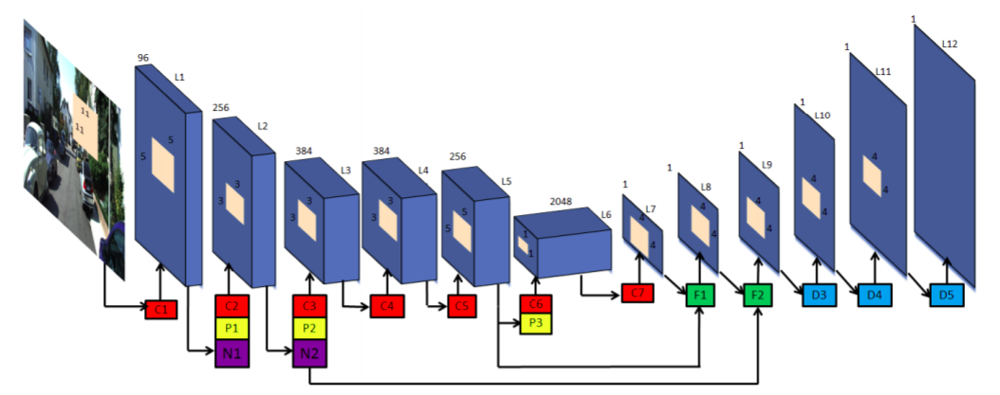
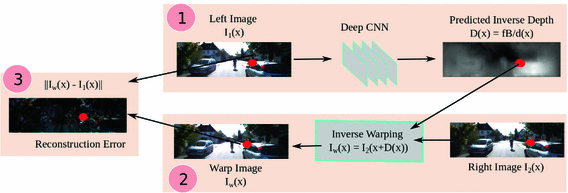
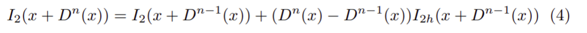
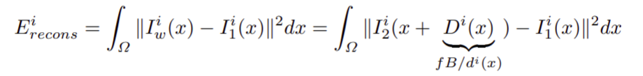
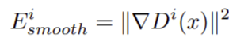
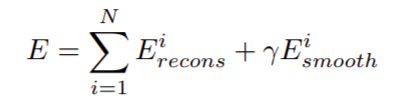
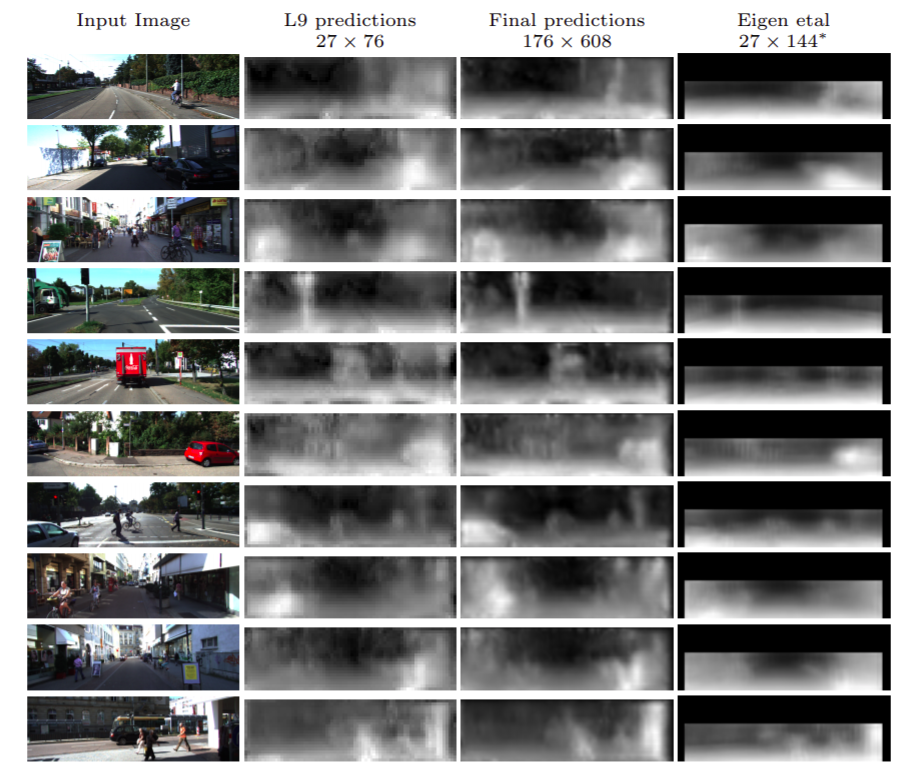

# Unsupervised CNN for Single View Depth Estimation: Geometry to the Rescue

## Introduce: 
     

The significant weakness of most current deep Convolutional
Neural Networks is the need to train them using vast amounts of manually labelled data. So this paper propose unsupervised method for solve the disavantaged of supervised method. They achieve that by training the network in a manner analogous to an autoencoder. At training time they consider a pair of images, source and target, with small, known camera motion between the two such as a  stereo pair or a 2 frame of a video. They train the convolutional encoder for the task of predicting the depth map for the source image. To do that, they explicitly generate an inverse warp of the target image using the predicted depth and known inter-view displacement, to reconstruct the source image; the photometric error in the reconstruction is the reconstruction loss for the encoder.  

## Idea:

- As paper said, they use pair of image captured from stereo camera (left, right). First the left image is use as input for the **Encoder**, so we have the **Predicted Inverse Depth (disparity map)** as output. After that, they upsampling the disparity map to original size. The "**Decoder**" take 2 input: the disparity map after upsampling and the right image, and they apply the formula: I(x) = I2(x + D(x)) to generate the **Warp Image**. The Warp Image then use to caculate the loss and update weight for encoder
- Because of the warp image was synthesised as a non-linear function, so the author use a little bit of Taylor to make it linear:   

    
## About the loss:
They use 2 los function:  
- Loss recons:   

    

- Loss smooth:  

    

The total loss is:  

## Result

## Link git:
[Unsupervised_Depth_Estimation](https://github.com/Ravi-Garg/Unsupervised_Depth_Estimation)
