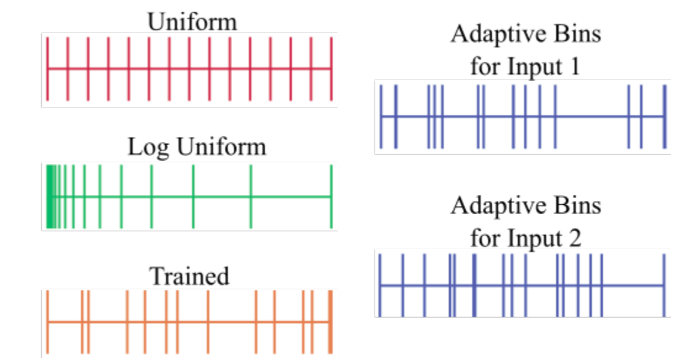
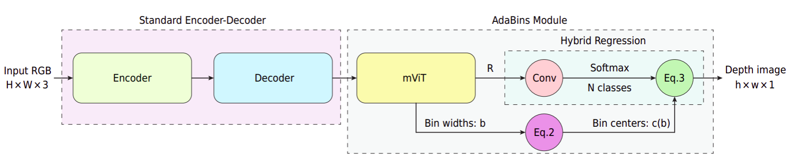
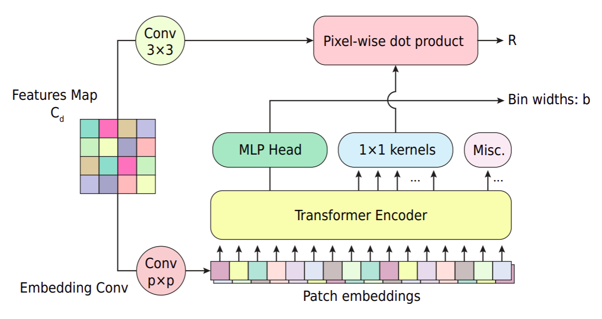

# Adabins: Depth Eestimation Using Adaptive Bins

## Introduce
<p>Motivation ban đầu của paper đến từ suy đoán rằng các kiến trúc hiện tại không khai thác được triệt để thông tin global từ input image. Nhuợc điểm của CNN là nó chỉ có thể khai thác thông tin gloabl khi tensor rất nhỏ. Tuy nhiên nhóm tác giả tin rằng việc khai thác thông tin global ở high resolution sẽ mang lại hiệu quả lớn. Ý tưởng chung của nhóm tác giả đó là khai thác thông tin global từ output của kiến trúc Encoder-Decoder truyền thống và dùng một mạng để refine output ở high resolution.   

<p>Với các hình ảnh RGB khác nhau, depth range của chúng phân bố rất khác nhau. Ngoài ra, vì đây cũng là một bài toán ill-posed, nên việc depth range phân bố khác nhau sẽ làm cho depth regression trở nên challenge hơn. Gần đây một vài paper đã đưa ra các assumptions như planarity constraints, tuy nhiên không chỉ phù hợp trên một vài dataset, không general.
<p>Paper này không dùng assumption mà tiếp cận bằng cách dạy mạng adaptively focus vào các vùng có depth tập trung nhiều.

**New things:**    
<ul>
    <li> Propose kiến trúc mạng có thể xử lí thông tin global từ ảnh. 
    <li> Propose chia depth range thành các bins thay đổi theo từng ảnh
</ul>

## Methodology
### Motivation
[Fu et al](https://arxiv.org/pdf/1806.02446.pdf) nhận thấy có thể cải thiện performance của depth estimation nếu chuyển từ depth regression task thành depth classification task. Vì vậy họ đã đề xuất chia depth range thành fixed number of bins với width của bins xác định trước. Từ đây đã tạo ý tưởng cho paper này.
- **Đầu tiên**, tác giả đề xuất *bin width* phải được tính toán lại và thay đổi tùy theo các features của ảnh input. 
- **Thứ hai**, tuy cách tiếp cận depth classigication tốt (đạt eveluation metrics tốt trên các tập dữ liệu), nhưng chất lượng depth map không tốt, giá trị độ sâu sẽ bị rời rạc (không liên tục) nên không đúng thực tế lắm, vì vậy sẽ ảnh hưởng đến các task liên quan như 3D reconstruction from 2D image. Vì vậy tác giả đã đề xuất tính toán depth map dựa trên bằng cách linear combination từ các center của các bins.
- **Cuối cùng**, tính toán thông tin global ở các high resolution chứ không chỉ ở bottleneck (feature map ở low resolution)

### Adabin designs
- **Các chiến lược để chia bins**:
    
    -  Fixed bins with a uniform bin width: Chia depth range thành các bin có bin width như nhau
    -  Fixed bins with a log scale bin width: Chia depth range thành các bin có bin width như nhau nhưng ở log scale 
        - VD depth range là [a,c], ta chia thành 2 bin [a,b] và [b,c], sao cho:   
        ```log(c)-log(b) = log(b)-log(a)```
    - Trained bin widths: train mạng riêng để học bin width cho từng tập dataset, nghĩa là các hình ảnh trong tập dataset đó sẽ có bin width như nhau
    - AdaBins: bin width sẽ được tính toán adaptively trên mỗi ảnh input (using in this paper)
- Chia depth range thành các bin và gán mỗi pixel cho một bin tương ứng. Điều này sẽ dẫn đến vấn đề như đã nói ở trên, đó là depth map sẽ rời rạc :(( . Nhưng không sao, sau đó mình có thể dùng linear combination là depth map lại smooth ngay :))
- Gần đây cộng đồng AI có xu hướng cuồng attention, các SOTA trước hay dùng attention theo thứ tự Encoder - Attention - Decoder. Như vậy chỉ bắt được global information ở low resolution, nên tác giả đã đổi thứ tự lại: Encoder - Decoder - Attention nên đã bắt được global information ở high resolution. 
- Sử dụng một mạng đơn giản: Encoder dùng EfficientNet B5 làm backbone, decoder chỉ đơn giản là upsampling.

### Architecture description

<p>Kiến trúc gồm 2 phần chính:    

- Standard Encoder Decoder:
    - Chỉ là mạng Encoder-Decoder bình thường, Encoder dùng backone EfficientNet B5, Decoder dùng upsampling
- Adabins module

<p>Output từ Decoder gọi là Decoded Feature, có dạng (h,w,c) ở trong paper này c = 128, được xem như 1 feature map dùng cho module Adabin. Module Adabin nhận input là Decoded Feature, output dạng (h,w,1). Tuy nhiên để tiết kiệm tài nguyên và tăng batch size trong lúc training, ta có thể dùng h = height/2, w = width/2, lúc sau có thể dùng bilinear upsampling depthmap lên.


<p>Block đầu của module Adabin gọi là mini-ViT, nó sử dụng một kiến trúc Transformer đơn giản, output sẽ là:

- Vector binwidth <b>b</b>
- Range-AttentionMaps <b>R</b> dạng (h,w,C) chứa thông tin global.

**Bin-width**
asd