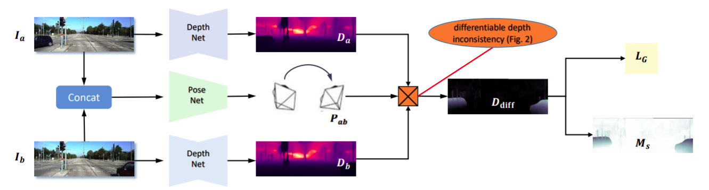
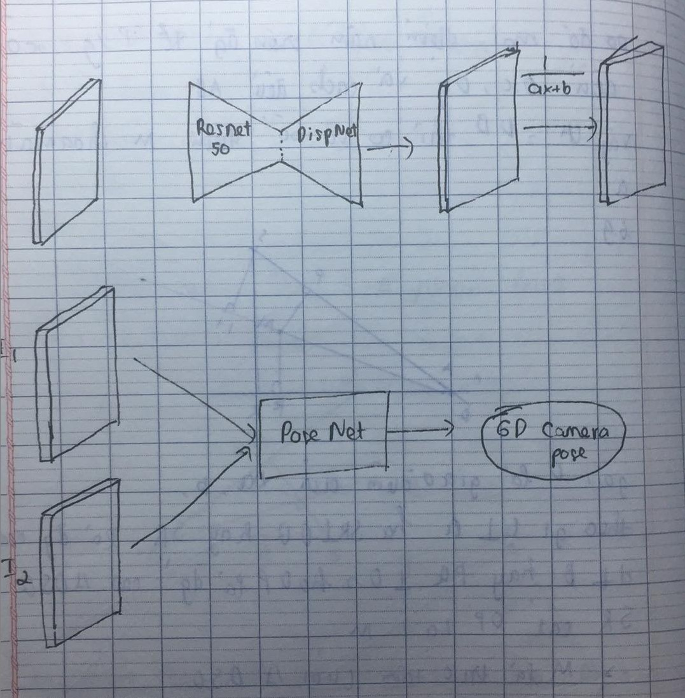
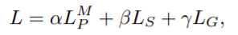
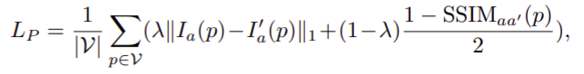
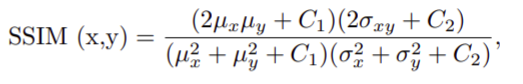
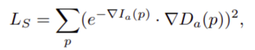
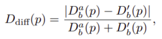
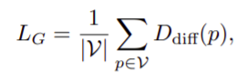
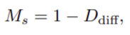
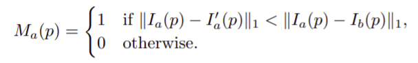

# Unsupervised Scale-consistent Depth Learning from Video

## Introduce
 
- With unsupervised learning for depth estimation, the color consistency between multiple views serves as the main supervision signal.
- Use video dataset because  it has a minimum requirement for training data.
- Disadvantage: 
    - Unknow scale => ralative depth, opposited to metric in real world while supervised is absolute depth.
    - Video-based learning is that methods may generate scale-inconsistent predictions over different frames since they suffer from a perframe scale ambiguity. This does not impact the single image based tasks, while it is critical for video-based applications,

- New things proposion:
    - **Propose a geometry consistency loss (LG)** to encourage networks to predict scale-consistent depths. It explicitly penalizes the pixel-wise inconsistency of predicted depths between adjacent frames during training. It enables more effective learning and allows for more consistent predictions at inference time
    -  **Propose a self-discovered mask (Ms)** for handling moving objects during training, which violates the underlying static scene assumption. It improves the performance significantly and does not require additional overhead since the proposed mask is simply derived from LG.

## Relative work:
- According to the training data, we can categorize learningbased methods into four classes:
    - Use the sensor captured depths  
        => expensive
    - Collect stereo images or videos from the web and use off-the-shelf tools to compute dense groundtruth depths.   
        => obtain cheap GT, does not generalize accross different scenes and depth map is relative. 
    - Use the calibrated stereo images for training models  
        => requires well-calibrated stereo cameras to collect training data
    - Use unlabelled video for training model.
        => Simply, generalize, most research.

- Proposed geometry consistency loss is technically similar to two previous methods. 
    - A paper proposed a 3D ICP loss to penalize the misalignment of predicted depths, where they approximate gradients for depth and pose networks independently because the ICP is not differentiable. This ignores second-order effects between depth and pose networks, and hence it limits the performance. By contrast, our geometry consistency loss is naturally differentiable and results in better performance
    -  A paper proposed a depth consistency loss, which enforces corresponding points in two images to have identical depth predictions.  This is physically incorrect because the scene depth is view-dependent. We instead synthesize the depth for the second view using the predicted depth in the first view via rigid transformation, and we penalize the difference between predicted depths and synthesized depths in the second view   
    => Improve depth accuracy also as scale-consistent

- Paper propose masking dynamic object from the geometry consistency loss, it is able to handle arbitrary dynamic object.

## Idea

- With 2 image I1, I2 as input, we firstly estimate the depth (D1, D2) and pose matrix (P) by the depth and pose network respectively. With predicted depth and pose, we can synthesize the reference image I1 using the source image I2 by differentiable warping, so we have I'1. Then we supervise the network by photometric loss between I'1 and I1. In training phase, we use  geometry consistency loss LG to explicitly constrain the depth CNN to predict scale-consistent results on adjacent frames. 
- To handle invalid case, we use self-discovered mask Ms for dynamic object and auto-mask Ma for static pixel

## About Loss
  

### Geometric consistency loss

* We compute the geometric consistency loss as follow:
    - Inference the depth D^a_b which is the depth of I_b inferenced from depth *D_a* and pose *P*.
    - Then, we hope to compute the difference between *D^a_b* and *D_b*. However, it is not practical because the projection does not religiously lie in the grid of *D_b*. Therefore, we obtain the D'_b by using the differentiable bilinear interpolation.
    - Compute the D_diff.
    - Compute the geometry consistency loss by the formular:  
        

## About the mask
- In unsupervised depth learning framework, we always have the assumption: the **moving camera** and **static scence**. So the moving object and static camera always provide the invalid signals, which hamp the training process. To overcome that, we propose 2 mask:

### Self-discovered mask
- Used for moving object.
- The formular as:  
    
    - Consider the D_diff, we see that the moving objects often make the large inconsistent, so that the subtraction between 2 depth is large, so it near to 1, so from the formular, the moving object come  to 0 and vice versa.

### Auto mask
- Used to remove static camera pixels.
- The formular as:  
    
    - If the pixel is static, so the subtraction between 2 image come to 0, so the M_a of it -> 0 and the similar.

