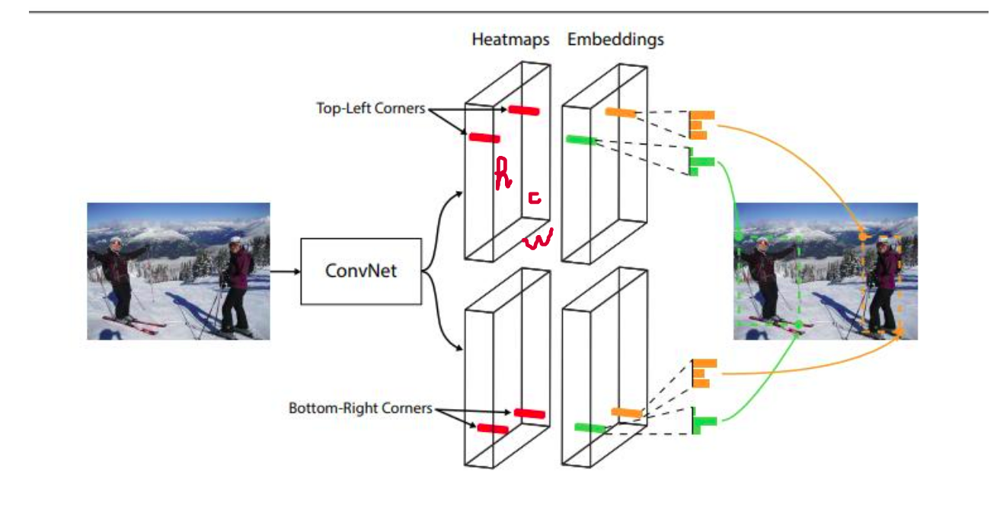

# Corner Net
## Introduction
Up to now, Object-Detection has used anchor box to detect object. Anchor box được sử dụng hiệu quả trong One-State detector, which can highly archive result competitive with two-state detectors. Anchor box được sử dụng densely trên hình ảnh, sau đó sinh ra bounding box by scoring anchor boxes and refining it close to ground-truth by regression.  

However, using anchor box have 2 drawbacks:  
- First, we have to **use a large number of anchor boxes**, bởi vì ý tưởng cơ bản là từ các anchor box trên hình ảnh, ta sẽ chọn các anchor box đủ overlap với ground-truth để refine, vì vậy cần một lượng lơn anchor box để đảm bảo không bỏ sót object. As a result, a tiny fraction of anchor boxes will sufficiently overlap with Ground-truth. This lead to huge imbalance between postive and negative anchor boxes, làm ảnh hưởng training.
- Second, ta phải tự design thủ công các tham số cho anchor boxes (ratio, size, number anchor box, ...). Đa phần phải design dựa trên kinh nghiệm, vì vậy sẽ rất khó để design, đặc biệt là multiscale architecture.

Corner Net đã đề xuất ra cách tiếp cận mới, instead of using anchor boxes, it detect object as a pair of keypoints (top-left, bottom-right). Corner Net sẽ predict ra 3 outputs: 
- A feature-map for top-left corners.
- A feature-map for bottom-right corners.
- A embedding vector to group pair of (top-left, bottom-right) belong to the same object. Đây là 1 network để predict similarity between 2 corner.  

  

Như trong hình đầu tiên, hình ảnh sẽ qua ConvNet để trích xuất đặc trưng, sau đó sẽ chia ra làm 2 nhánh và qua 1 đống ConvNet để thu được 2 Heatmap (top-left heatmap & bottom-right heatmap). Heatmap có dạng (h,w,c) trong đó c là số class, nghĩa là mỗi chanel sẽ detect corner keypoint for each class
 

